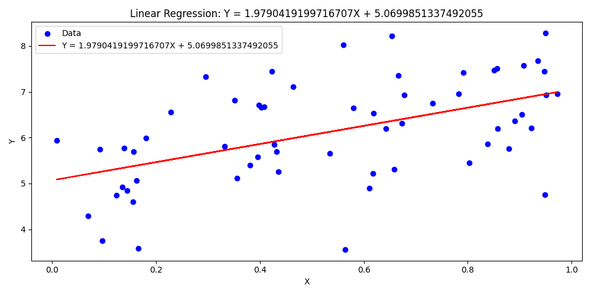
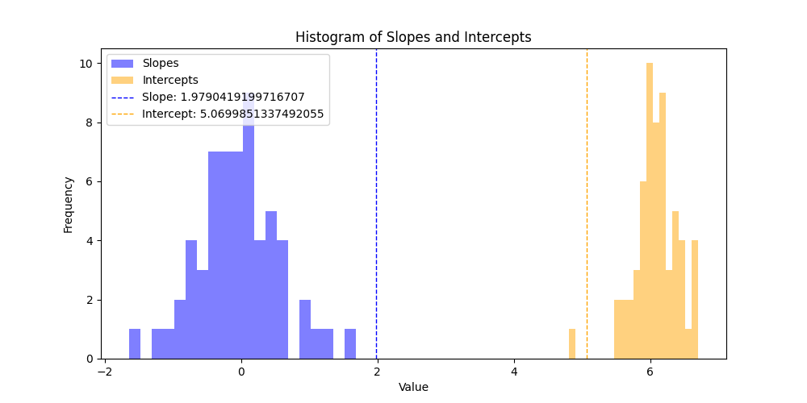

# Assignment 6: Linear Regression Simulation

Demo Video: [YouTube Link](https://youtu.be/UPPpMMz5H4U)

## Project Overview
This project simulates random datasets to investigate how different parameters impact the results of linear regression, specifically in cases where there may be no actual relationship between the variables. Through the simulation interface, users can experiment with various values of intercept, slope, mean, variance, sample size, and simulation count, observing how these influence regression estimates and the stability of results.

## Key Observations

### Effect of Sample Size (N)
- **Large N (e.g., N=500)**: Estimates become more stable and less variable, with slopes concentrated around the true value.
- **Small N (e.g., N=10)**: Results show higher variability, leading to more extreme and diverse slopes.
- As sample size increases, histograms of regression estimates become more bell-shaped and narrower, reflecting greater stability.

### Impact of Variance (σ²)
- **Low variance (σ²=1)**: Points are more clustered, yielding consistent and stable regression estimates.
- **High variance (σ²=5)**: Causes data to be more scattered, resulting in broader distributions and less reliable estimates.
- Higher variance can obscure any real patterns in the data, making it harder to discern relationships.

### Interesting Parameter Combinations

1. **Baseline Case**
   - Parameters: N = 50, μ = 0, σ² = 1, S = 1000
   - Outcome: Demonstrates typical variation in estimates without strong deviations.

2. **High Variance Example**
   - Parameters: N = 50, μ = 0, σ² = 5, S = 1000
   - Outcome: Shows how added noise can make estimates less reliable, with increased variability.

3. **Large Sample Effect**
   - Parameters: N = 500, μ = 0, σ² = 1, S = 1000
   - Outcome: Highlights how larger sample sizes contribute to more stable and reliable regression results.

## Generated Plots
Here are example plots generated with the following parameters:
- N = 50
- μ = 10
- σ² = 1
- S = 1000

### Scatter Plot with Regression Line

### Histogram of Slopes and Intercepts

## Key Insights
- Both sample size and variance significantly impact the reliability of regression estimates.
- Even when no true relationship exists, random data can create apparent patterns due to chance.
- Larger sample sizes improve estimate stability, but high variance remains a challenge.
- Understanding how sample size and variance affect results is crucial when interpreting regression outcomes in real-world applications.